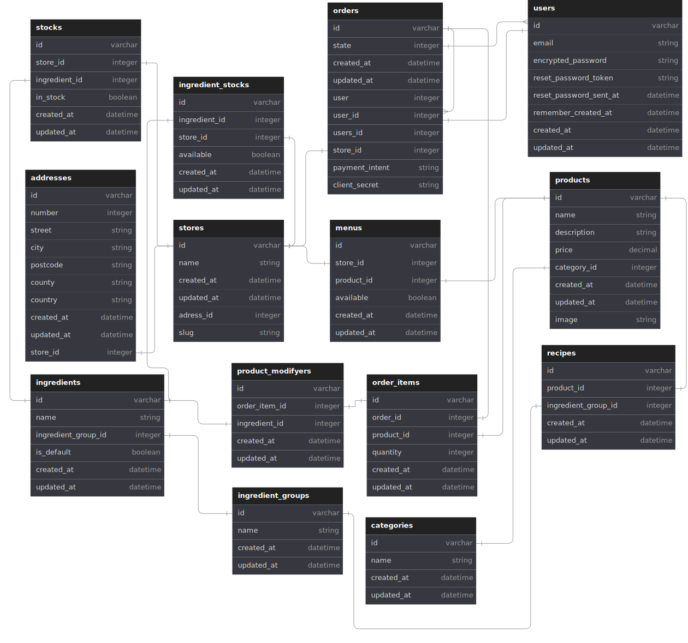

 
---
  

 


# Alpaca Cafe
A dissertation project.

An online ordering for in-person collection for a medium sized, multi store coffee shop system.

This system has support for multi store menus with independent product availability. Allows for customer customization of drinks.

## Running the System yourself

If you would like to have a local version, for whatever reason (which is odd because why?), heres how.

You'll first need `ruby 3.2.2`

Clone the repo to a suitable location.

```bash
git clone https://github.com/TidalCub/Alpaca-Cafe
```

Install dependencies

```bash
bundle install
```

Then run seed

```bash
bundle exec db:seed
```

And your good to go! Run the server
```bash
rails s
```

# An overview of the project

The project is a slightly complicated interlocking system.

## Database


_Correct as of Commit 068fc40_

## Payment

The Stripe payment flow

## Infrastructure


For redundancy, HaProxy will be used, with two instances of the application.

Postgres will be configured in a master-slave relationship for redundancy.

### Scalability
This setup allows for more instances of the application to be deployed quickly to meet potential demand. 

The master-slave postgres setup allows for additional postgres instances if needed.

### Reliability
HaProxy performs health checks on servers and will route accordingly 

The web servers will be configured with both postgres instances, in the event of the master going down, the web servers will then try to establish a connection with the next available slave. Example:

```yaml
production:
  primary:
    database: primary_database
    username: root
    password: <%= ENV['ROOT_PASSWORD'] %>
    adapter: mysql2
  primary_replica:
    database: primary_database
    username: root
    password: <%= ENV['ROOT_READONLY'] %>
    adapter: mysql2
    replica: true
```

This will allow for automatic failover of databases without intervention.

Some notes:
- Primary_replica is read and write so features can continue.
- It may be of use for more reliability that a third read-only database be set up, in the event of two failed databases, something is properly very wrong, and this will preserve data. 